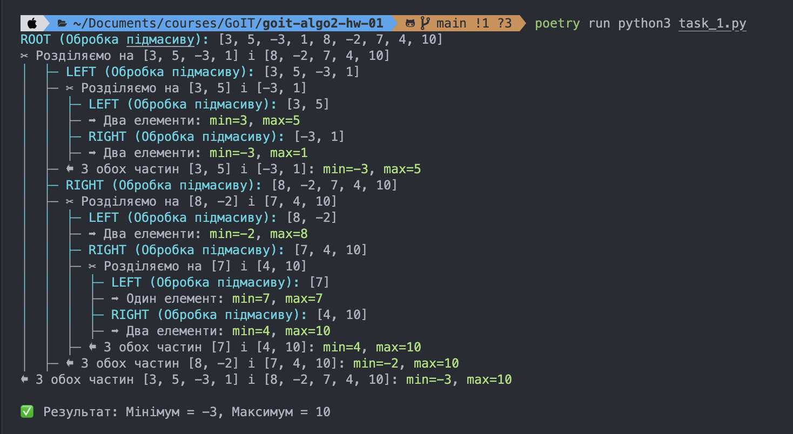

## Local Setup and Running

1. Install Poetry if not already installed:
```bash
curl -sSL https://install.python-poetry.org | python3 -
```

2. Clone the repository and navigate to the project directory:
```bash
git clone <repository-url>
cd goit-algo2-hw-01
```

3. Install dependencies:

```bash
poetry lock
```

```bash
poetry install
```

4. Activate Poetry virtual environment:
```bash
poetry env activate
```


5. Start the server:
```bash
poetry run python3 task_1.py
```


# TASK RESULT

